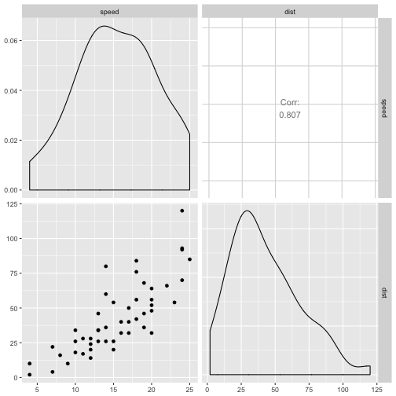
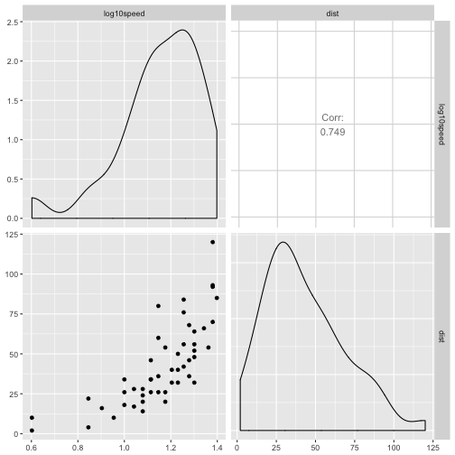
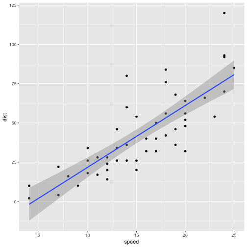

modeling
========================================================
author: Ana I. Bento & John M. Drake
date: 
autosize: true

========================================================

```r
library(GGally); library(magrittr); data(cars) 
cars %>% ggpairs(columns=c("speed","dist"))
```




========================================================

```r
library(dplyr); cars %<>% mutate(log10speed=log10(speed))
cars %>% ggpairs(columns=c("log10speed","dist"))
```



Reproducibility and subsampling
========================================================

```r
x <- tibble(rnorm(10)) %>% print
```

```
# A tibble: 10 x 1
   `rnorm(10)`
         <dbl>
 1       0.140
 2      -0.371
 3       1.34 
 4      -0.161
 5       1.52 
 6      -1.34 
 7      -0.401
 8       1.55 
 9       0.459
10      -0.960
```

Reproducibility and subsampling
========================================================

```r
x %>% sample_n(5)
```

```
# A tibble: 5 x 1
  `rnorm(10)`
        <dbl>
1       1.34 
2       1.55 
3       1.52 
4       0.459
5      -0.401
```

Reproducibility and subsampling
========================================================

```r
x %>% sample_n(5)
```

```
# A tibble: 5 x 1
  `rnorm(10)`
        <dbl>
1      -0.161
2       0.459
3      -1.34 
4       1.55 
5       0.140
```

Reproducibility and subsampling
========================================================

```r
set.seed(123); x %>% sample_n(5) #1st call
```

```
# A tibble: 5 x 1
  `rnorm(10)`
        <dbl>
1       1.34 
2       1.55 
3      -0.161
4      -0.401
5      -1.34 
```

Reproducibility and subsampling
========================================================

```r
set.seed(123); x %>% sample_n(5) #2nd call
```

```
# A tibble: 5 x 1
  `rnorm(10)`
        <dbl>
1       1.34 
2       1.55 
3      -0.161
4      -0.401
5      -1.34 
```

Linear modeling
========================================================

```r
library(ggplot2)
ggplot(cars)+geom_point(aes(speed,dist))+
  geom_smooth(aes(speed,dist),method="lm")
```




Linear modeling
========================================================

```r
summary(lm(speed~dist,data=cars))
```

```

Call:
lm(formula = speed ~ dist, data = cars)

Residuals:
    Min      1Q  Median      3Q     Max 
-7.5293 -2.1550  0.3615  2.4377  6.4179 

Coefficients:
            Estimate Std. Error t value Pr(>|t|)    
(Intercept)  8.28391    0.87438   9.474 1.44e-12 ***
dist         0.16557    0.01749   9.464 1.49e-12 ***
---
Signif. codes:  0 '***' 0.001 '**' 0.01 '*' 0.05 '.' 0.1 ' ' 1

Residual standard error: 3.156 on 48 degrees of freedom
Multiple R-squared:  0.6511,	Adjusted R-squared:  0.6438 
F-statistic: 89.57 on 1 and 48 DF,  p-value: 1.49e-12
```


Lists
========================================================

```r
y<-list(3.14,"eggs",lm(speed~dist,data=cars)) %>% print
```

```
[[1]]
[1] 3.14

[[2]]
[1] "eggs"

[[3]]

Call:
lm(formula = speed ~ dist, data = cars)

Coefficients:
(Intercept)         dist  
     8.2839       0.1656  
```


Correlation coefficients
========================================================

```r
cor.test(cars$speed,cars$dist,method="spearman")
```

```

	Spearman's rank correlation rho

data:  cars$speed and cars$dist
S = 3532.8, p-value = 8.825e-14
alternative hypothesis: true rho is not equal to 0
sample estimates:
      rho 
0.8303568 
```


modelr
========================================================

* create models from data
* store modeling information with data
* group and nest data for analysis
* un-nest for visualization

