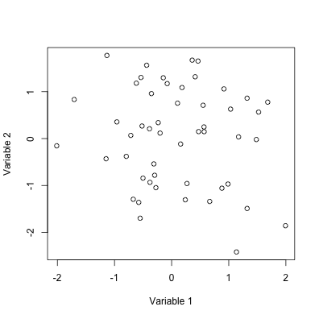

Writing computer programs for data analysis
========================================================
author: John M. Drake & Andrew W. Park
date: 
autosize: true


Key commands 1
========================================================

**Assignment**


```r
a <- 5
print(a)
```

```
[1] 5
```


Key commands 2
========================================================

**Arithmetic operations**


```r
3+5
```

```
[1] 8
```

```r
5-3
```

```
[1] 2
```

Key commands 2
========================================================

**Arithmetic operations (continued)**


```r
4*6
```

```
[1] 24
```

```r
119/10
```

```
[1] 11.9
```

Key commands 3
========================================================

**Advanced arithmetic**


```r
5^4
```

```
[1] 625
```

```r
exp(2)
```

```
[1] 7.389056
```

Key commands 3
========================================================

**Advanced arithmetic (continued)**


```r
log(10)
```

```
[1] 2.302585
```

```r
log10(10)
```

```
[1] 1
```

```r
log(10, base=10)
```

```
[1] 1
```


Key commands 4
========================================================


**Logic**


```r
4 == 6
```

```
[1] FALSE
```

```r
6 == 6
```

```
[1] TRUE
```

Note that TRUE/FALSE can be treated like 1/0


```r
(6 == 6) * 3
```

```
[1] 3
```

Key commands 5
========================================================

**Logic**


```r
4 != 6
```

```
[1] TRUE
```

```r
4 > 6
```

```
[1] FALSE
```


Key commands 5
========================================================

**Logical operators commonly used in R**

| Syntax        | Meaning           | 
| :-----------: |:-------------:| 
| `x == y`      | x equals y |
| `!`      | negation      | 
| `x > y` | x is greater than y    | 
| `x < y` | x is less than y    | 
| `x >= y` | x is greater than or equal to y    | 
| `x <= y` | x is less than or equal to  y    | 


Scripting
========================================================

R programs are called *scripts*

- Written in editor
- Handy tools like *syntax highlighting* and *error checking*
- Use # to indicate *comments*


```r
a <- 3 # This code assigns "3" to the variable "a" and includes a comment
```


Scripting
========================================================

**Prototypical script**

1. Header (comments about *function*, *author*, *contact*, *date*, and *change log*)
2. Load packages
3. Declare functions
4. Load data
5. Analysis

**Script is always evaluated in sequence**


Functions
========================================================

**A function is a *program-within-a-program* to automate a *common task*.**

Advantages of using functions

- *Interpretability*: A function can be given an *evocative name* that makes the code easier to understand
- *Simplicity*: As requirements change updates are made in only one place
- *Robustness*: Reduces the frequency of mistakes

Functions
========================================================

**A function is a *program-within-a-program* to automate a *common task*.**

Components of a function

1. Name
2. Arguments
3. Body

**Functions are for humans and computers**

Example function
========================================================

Declare the function

```r
mean <- function(x){
  s <- sum(x)
  n <- length(x)
  m <- s/n
  return(m)
}
```

Demonstrate use

```r
x <- c(2,6,8,4)
mean(x)
```

```
[1] 5
```


Checking values 1
========================================================

A function for calculating the weighted mean

```r
wt_mean <- function(x,w){
  m <- sum(x*w)/sum(w)
  return(m)
}
```

Demonstrate use

```r
x <- c(2,6,8,4)
w <- c(2,2,1,1)
wt_mean(x,w)
```

```
[1] 4.666667
```

Checking values 2
========================================================

But, what if `x` and `w` aren't the same length?

```r
x <- c(2,6,8,4)
w <- c(2,1,2)
wt_mean(x,w)
```

```
[1] 6.8
```

How does this even work?

Checking values 2
========================================================

A more robust function for calculating the weighted mean

```r
wt_mean2 <- function(x,w){
  if(length(x) != length(w)){
    stop('`x` and `w` must be the same length', call.=FALSE)
  }
  m <- sum(x*w)/sum(w)
  return(m)
}
```


```r
wt_mean2(x,w)
```


Google R style guide
========================================================

We recommend Google R style for scripts and functions  
<https://google.github.io/styleguide/Rguide.xml>

<font size=5px>


```r
wt_mean2 <- function(x,w){
  # Computes the mean of a sample adjusted according to provided weights
  #
  # Args:
  #   x: vector of values to be averaged
  #   w: vector of weights
  #
  # Returns:
  #   the weighted mean, a single value

  # Error handling
  if(length(x) != length(w)){
    stop('`x` and `w` must be the same length', call.=FALSE)
  }
  
  # Computation
  m <- sum(x*w)/sum(w)
  return(m)
}
```

</font>

Pipes
========================================================

The pipe (`%>%`), from the `magrittr` package, is a tool for clearly expressing a sequence of multiple operations


Pipes
========================================================


**A clunky analysis**


```r
x <- rnorm(100)
y <- matrix(x, ncol=2)
plot(y, xlab='Variable 1', ylab='Variable 2')
```


Pipes
========================================================

**A cleaner version with pipes**


```r
library(magrittr)
rnorm(100) %>% 
  matrix(ncol=2) %>% 
  plot(xlab='Variable 1', ylab='Variable 2')
```




Flow of control
========================================================

**Conditional execution**
- `if`
- `else`
- `ifelse`

***

**Loops**
- `for`
- `while`
- `repeat`

**Flow in loops**
- `break`
- `next`

Conditional execution: Three examples
========================================================

**Example 1**


```r
a <- 1
b <- 2

if(a==1) c <- b
print(c)
```

```
[1] 2
```


Conditional execution: Three examples
========================================================

**Example 2**


```r
a <- 1
b <- 2

if(a==2) {
  c <- b
  } else {
    c <- a+b
}

print(c)
```

```
[1] 3
```

Conditional execution: Three examples
========================================================

**Example 3**


```r
a <- 1
b <- 2

ifelse(a==2, c <- b, c <- a+b)
```

```
[1] 3
```


Loops
========================================================

**Simple iteration**


```r
j <- 0
for(i in 1:5){
  j[i+1] <- i*2
  print(j)
}
```

```
[1] 0 2
[1] 0 2 4
[1] 0 2 4 6
[1] 0 2 4 6 8
[1]  0  2  4  6  8 10
```

Looping over 
========================================================

**Any vector**


```r
for(prefix in c('b','c','m','r')){
  word <- paste(prefix, 'at', sep='')
  print(word)
}
```

```
[1] "bat"
[1] "cat"
[1] "mat"
[1] "rat"
```


R Help
========================================================

Use `?` as in `?mean`

- Description
- Usage
- Arguments
- Details
- Value
- References
- **Examples**


References
========================================================

Wickham, H. 2010. A layered grammar of graphics. *Journal of Computational and Graphical Statistics* 19:3–28

