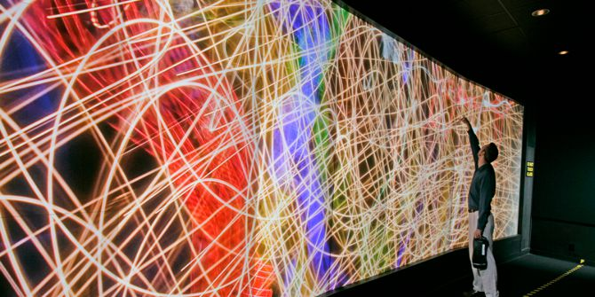
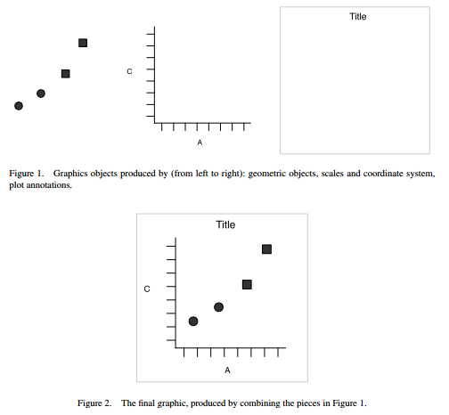
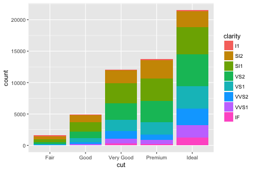

Introduction to data visualization
========================================================
author: John M. Drake & Andrew W. Park
date: 
autosize: true


Why this workshop?
========================================================

"Coding is a basic science skill"
- Dr. James Olds, Assistant Director for Biological Sciences, National Science Foundation

Overview
========================================================

- Data visualization
- Writing computer programs
- Data wrangling
- Modeling
- Project management


R/RStudio
========================================================


***

<http://www.r-project.org/>


Why look at data?
========================================================




How to look at data?
========================================================

- Scatterplot
- Box-and-whisker diagram
- Barplot
- Map
- Network


A grammar of graphics
========================================================

Grammar - The fundamental principles or rules of an art or science 

- OED, quoted in Wickham (2010)

***




A plot
========================================================

Consists of
- A dataset and mappings from *variables* to *aesthetics*
- One or more *layers*
- A *scale* for each mapping
- A *coordinate system*
- A *facet specification* (usually for multi-panel plots)

A layer
========================================================

Consists of
- Data and aethetic mapping
- A statistical transformation
- A geometric object
- Position adjustment

***


A graphing template
========================================================

`ggplot(data=<DATA>) + <GEOM_FUNCTION>(mapping=aes(<MAPPINGS>))`


```r
library(ggplot2)
ggplot(data=diamonds) + 
  geom_bar(mapping=aes(x=cut, fill=clarity))
```




Aesthetics
========================================================

An *aesthetic* is a visual property attached to some data in a plot, e.g. 

* Size
* Shape
* Color


Exercises
========================================================

**Notes**

- This workshop addresses visualization, programming, and data wrangling separately, but they're inevitably intertwined. You will have to do some data wranging (e.g. with the package `lubridate`) and minor programming (e.g. assignment operation) to complete this exercise. This may be frustrating. **Stick with it -- it's worth it!**
- A good strategy: Find an example -> Modify -> Compute. Repeat.
- Google is very helpful (especially **Stack Overflow** and **Cross Validated**)


References
========================================================

Wickham, H. 2010. A layered grammar of graphics. *Journal of Computational and Graphical Statistics* 19:3–28

